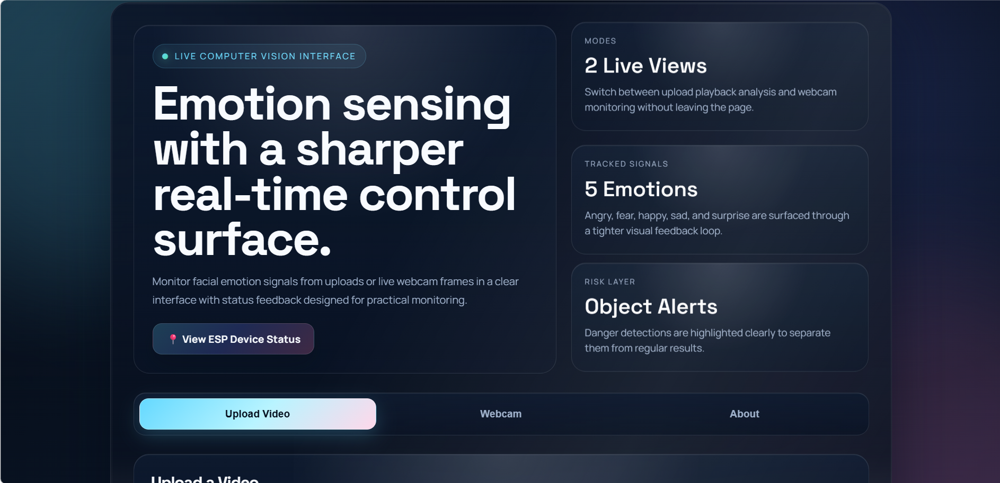
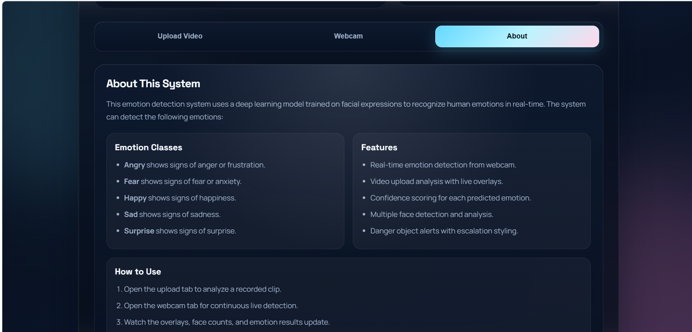
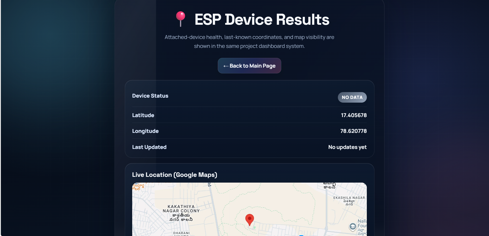
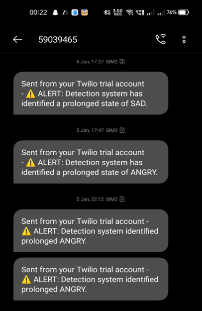
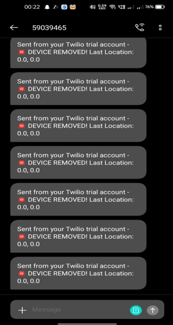

# 🛡️ Child Safety Monitoring System

## 📌 Overview

The Child Safety Monitoring System is a web-based application designed to enhance child safety through real-time monitoring using computer vision and IoT concepts.

The system provides live emotion detection, webcam monitoring, video upload analysis, ESP device monitoring, GPS location tracking, Google Maps integration, and emergency alerts through a modern dashboard.

---

# ✨ Features

- 👶 Real-time Child Monitoring
- 😊 Facial Emotion Detection
- 📹 Live Webcam Monitoring
- 🎥 Video Upload Analysis
- ⚠️ Harmful Object Detection
- 📍 GPS Location Tracking
- 🌍 Google Maps Integration
- 📡 ESP Device Monitoring
- 📱 SMS Alerts using Twilio
- 🌐 Responsive Web Dashboard

---

# 🛠️ Tech Stack

## Frontend
- HTML5
- CSS3
- JavaScript

## Backend
- Python
- Flask

## Computer Vision & AI
- OpenCV
- TensorFlow / Keras
- YOLOv8

## APIs & Services
- Google Maps API
- Twilio SMS API

## Tools
- Git
- GitHub
- Docker

---

# 📂 Project Structure

```text
app.py
danger_detector.py
emotion_engine.py
templates/
static/
screenshots/
requirements.txt
Dockerfile
README.md
```

---

# 🚀 Installation

### Clone the Repository

```bash
git clone https://github.com/BommenaDeepika/child-safety-monitoring-system-project.git
```

### Move to the Project Folder

```bash
cd child-safety-monitoring-system-project
```

### Create Virtual Environment

```bash
python -m venv venv
```

### Activate Virtual Environment (Windows)

```bash
venv\Scripts\activate
```

### Install Dependencies

```bash
pip install -r requirements.txt
```

### Run the Application

```bash
python app.py
```

Open your browser and visit:

```
http://127.0.0.1:5000
```

---

# 📸 Screenshots

## Home Page



---

## About Page



---

## ESP Device Dashboard



---

## Alert Messages



---

## Harmful Object Detection



---

# 🔮 Future Enhancements

- Mobile Application
- GPS Live Tracking
- Parent Dashboard
- Push Notifications
- Cloud Deployment
- Multi-camera Support

---

# 👩‍💻 Author

**Deepika Bommena**

Bachelor of Technology (Computer Science Engineering)

---

# 📄 License

This project is developed for educational and learning purposes.
